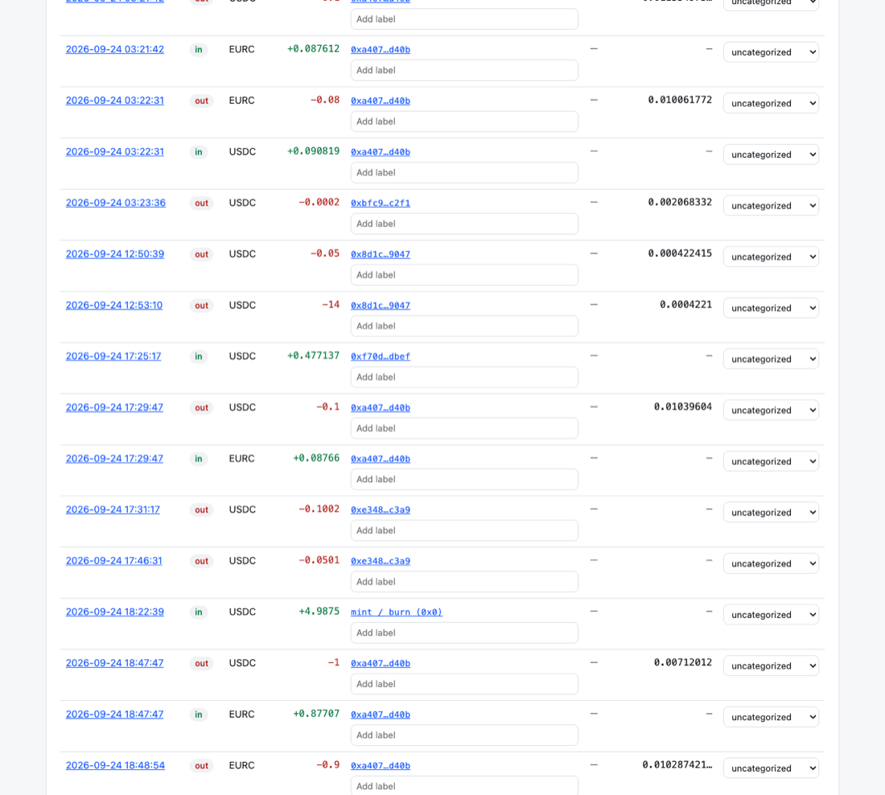

# Arc Ledger

**Exact books for Arc mainnet.** Paste an address and pick a period to get every USDC and EURC movement with memos and network fees in exact dollars.

It exports to Xero, QuickBooks or CSV. You can then close the period on chain, so an accountant can later prove the report file was not edited.

It runs entirely in the browser from public chain data: no server, no accounts, no API keys.



**Live app:** _link after deploy_ · **Contract:** `PeriodCloseRegistry` at _address after deploy_ ([explorer](https://explorer.arc.io))

## Why Arc

- **Gas is paid in USDC, so every fee is an exact dollar amount.** On Ethereum, gas is paid in ETH, which needs a price feed and a timestamp to value it, and two tools rarely agree. On Arc, `gasUsed × effectiveGasPrice` is already a USDC amount at 18 decimals. Arc Ledger books it to the last wei, and the totals reconcile to the on-chain balance with zero difference.
- **Every USDC movement is a log.** Arc emits an EIP-7708 `Transfer` log for native USDC sends, not only for ERC-20 calls. So a plain browser can list a business's full cash movements from public RPC, with no indexer.
- **Memos.** Arc's Memo contract attaches invoice IDs and payment references to transfers. Arc Ledger decodes them into the ledger and every export.
- **Deterministic finality.** A closed block never changes, so a closed period stays closed.

Arc is built for businesses, and businesses need books first. Among recent public Arc projects we found none that does accounting or accounting-software export.

## What it does

1. **Ledger.** Every movement in `[start, end)` UTC shows direction, asset, exact amount, counterparty, memo, and the fee when this address paid the gas. Private labels and categories are stored only in your browser.
2. **Reconciliation.** Opening balance + in − out − fees is compared with the on-chain closing balance. Any difference is shown as an explicit *Unexplained* line and is never dropped. The usual cause is gas spent on transactions that moved no funds, such as approvals. The report also shows how many transactions the address sent against how many it itemizes.
3. **Exports:**
   - **Generic CSV:** all fields at full precision, with fees as separate rows.
   - **Xero:** bank-statement CSV, one file per currency.
   - **QuickBooks Online:** 4-column CSV, split at 1,000 lines.
   - **JSON:** the canonical report.

   Xero and QuickBooks amounts are rounded to cents, and a rounding line keeps the statement equal to the real balance change.
4. **Close period.** The account signs one transaction (about 0.004 USDC) that stores the report's `keccak256` hash in `PeriodCloseRegistry`.
5. **Verify.** Anyone can drop the JSON file into the Verify screen, with no wallet. The possible results are:
   - ✅ matches close #N
   - ⚠️ an amended version exists
   - ❌ no matching close

## How Verify works

The report is serialized as deterministic JSON: sorted keys, no whitespace, and all money as decimal strings, a subset of RFC 8785. The `keccak256` of those bytes is the `reportHash`. See [docs/REPORT_SPEC.md](docs/REPORT_SPEC.md).

The registry stores `(reportHash, period, rowCount, closedAt, block)` under `msg.sender`, so an account can only close its own books. Closing the same period again with a new hash records an amendment, and the newest close wins.

Verify recomputes the hash in the browser and asks the contract with one `eth_call`. Private labels and categories sit outside the hashed part, so sharing them does not break verification.

## Repository

```
app/         Vite + React + TypeScript app (viem; wagmi only on the Close screen)
contracts/   Foundry project: PeriodCloseRegistry + tests + deploy script
docs/        ARC_FACTS.md (every chain fact with its source), REPORT_SPEC.md, examples/
```

## Local development

```bash
cd app
pnpm install
pnpm dev            # http://localhost:5173
pnpm test           # Vitest: money math, canonical hash golden files, CSV formats, mainnet fixtures
pnpm lint           # includes a no-float rule for all money code
pnpm probe          # prints the last 10 USDC movements of an address on mainnet

cd ../contracts
forge test          # 17 tests incl. fuzz
```

Optional: set `VITE_WALLETCONNECT_PROJECT_ID` to enable WalletConnect next to browser wallets.

## Limitations

- **Speed on the public RPC.** It allows about 1–2 log queries per second, with at most 10,000 blocks (~85 min) per query. One day takes under a minute, and a month takes about 10–15 minutes. You can paste your own RPC URL under *Advanced* to go faster.
- **Fee-only transactions are not itemized.** No log lists gas spent on transactions that moved no USDC/EURC for the address, and plain RPC has no "transactions by sender" method. These fees are still captured exactly in the *Unexplained* line.
- **Only USDC and EURC.** Other tokens (USYC, cirBTC, WETH) are out of scope.
- **No FX.** EURC stays in EUR, and the Xero and QuickBooks files are per currency.
- The QuickBooks import format follows Intuit's help pages but has not been tested against every regional QBO edition.

## Next

Google Sheets add-on, multi-address workspaces, EURC→USD FX conversion, PDF reports, name-service lookups, tagging rules, and optional server-side report storage.

## License

MIT
